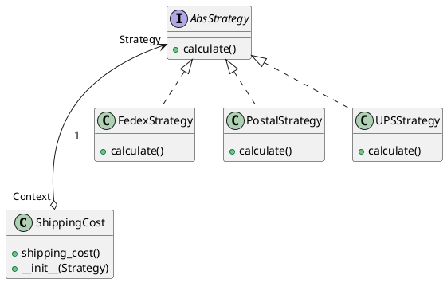
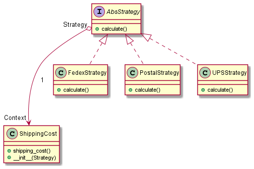

# Class Diagram to implement Strategy Pattern

```plantuml
@startuml classDiagram
class ShippingCost {
    + shipping_cost()
    + __init__(Strategy)
}

interface AbsStrategy{
    + calculate()
}

class FedexStrategy{
    + calculate()
}

class PostalStrategy{
    + calculate()
}

class UPSStrategy{
    + calculate()
}

AbsStrategy "Strategy" <---o "Context" ShippingCost : 1

AbsStrategy <|.. PostalStrategy
AbsStrategy <|.. FedexStrategy
AbsStrategy <|.. UPSStrategy

@enduml
```

